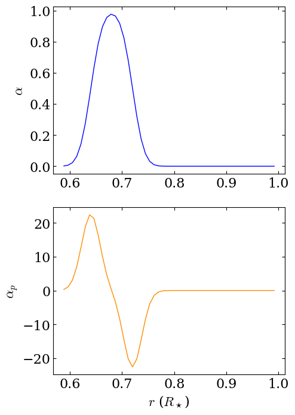
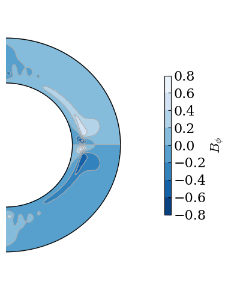
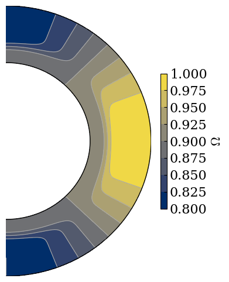
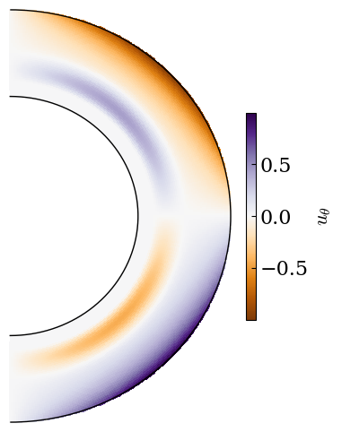
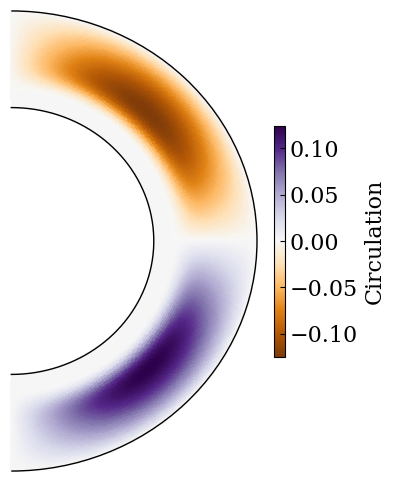
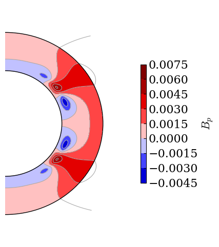
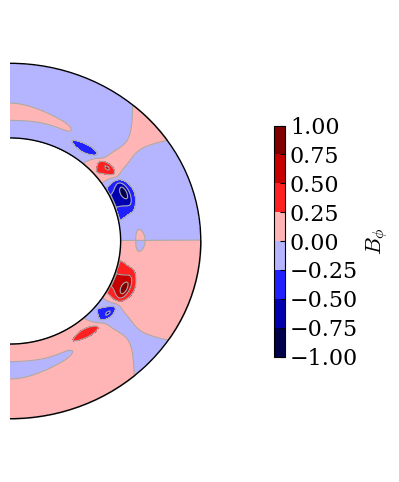
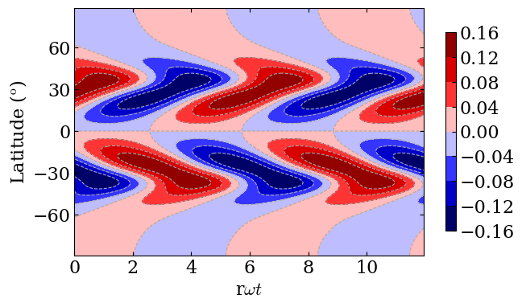
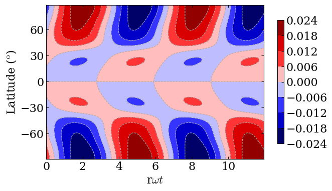

Get started with CTDYN
======================

The CTDYN code uses a finite-difference approach to search the
eigenvalues of the mean-field stellar dynamo problem corresponding to
oscillating solutions. This tutorial is aimed at presenting a
walkthrough of the main functionality of the ``py_ctdyn`` Python, which
allows to altogether configure CTDYN inputs, run the Fortran executable,
and analyse the outputs.

Before running this tutorial, you should check that you have compiled
CTDYN and that the ``$CTDYN_DIR$`` environment variable exists.

Running CTDYN
~~~~~~~~~~~~~

.. code:: ipython3

    import py_ctdyn as dyn

Once the module is imported, we can set some input parameters that will
be used to run CTDYN. This is done through a dictionary of dictionaries,
each of them corresponding to one of the namelist expected by the
Fortran code (e.g. ``outputs`` or ``global``).

.. code:: ipython3

    dir_out = "ctdyn_output"
    ctdyn_param = {"outputs" : {"dir":"'{}'".format (dir_out)},
                   }

The ``run_ctdyn`` function launches the CTDYN executable. A directory
containing the CTDYN outputs is created. CTDYN standard outputs are
redirected to ``ctdyn.out`` and error log to ``ctdyn.err``.

.. code:: ipython3

    dyn.run_ctdyn (ctdyn_param=ctdyn_param, verbose=True,
                   rerun=False)

.. parsed-literal::

    Running CTDYN with input file 'ctdyn_output/inlist_ctdyn'.

.. parsed-literal::

    {'outputs': {'dir': "'ctdyn_output'"},
     'global': {},
     'grid': {},
     'profiles': {},
     'brent': {},
     'boundaries': {},
     'fields': {},
     'physics': {},
     'controls': {}}

Analysing CTDYN results
~~~~~~~~~~~~~~~~~~~~~~~

The main parameters of the dynamo are summarised in a specific output
file. The dynamo is parameterised by a set of adimensioned coefficients.
:math:`C_\alpha` and :math:`C_\Omega`, related to the
:math:`\alpha`-effect and the stellar rotation, respectively, have the
following definition :

:math:`C_\alpha = \alpha_0 R_\star / \eta_t` ;

:math:`C_\Omega = \Omega_\star R_\star^2 / \eta_t` ;

where :math:`\alpha_0` is the amplitude of the :math:`\alpha`-effect,
:math:`\Omega_\star` is the stellar rotation frequency, and
:math:`\eta_t` is the turbulent diffusivity.

Depending on the choice of input, the control parameter for the
meridional circulation might depends on the :math:`C_\Omega`, in the
following way:

:math:`C_{\rm meridional} = Re_0 + Re_1 C_\Omega^{x_m}` ;

where the default value for :math:`x_m` is :math:`x_m = -0.45` (``xm``
parameter from the ``physics`` namelist). The Reynolds number related to
meridional circulation :math:`Re` can be computed as
:math:`v_{\rm meridional} R_\star / \eta_t`. :math:`Re_0` and
:math:`Re_1` corresponds to the quantities ``rm_i`` and ``rm_f`` from
the ``controls`` namelist.

In practice, in CTDYN, :math:`C_\Omega` is directly computed from the
inputs, and :math:`\eta_t` is computed from the relation between the two
quantities. The :math:`C_\Omega` (``co``) value can be set using the
``cm_i``, ``cm_f`` and ``nso`` parameters from the ``controls``
namelist. At the ``ii``\ th iteration on the range ``(0, nso)``, the
``co`` variable will take the value
``co = = cm_i + ii / (nso+1) * (cm_f - cm_i)``, which means that if
``nso > 0``, the code will explore and summarise different dynamo
configurations, varying :math:`C_\Omega`, :math:`C_{\rm meridional}`,
and :math:`\eta` in the process.

Finally the adimensioned frequency of the cycle (``omega_cycle``),
:math:`\overline{\omega}`, is connected to its dimensioned counterpart,
:math:`\omega`, through

:math:`\overline{\omega} = \omega R_\star^2 / \eta_t` .

.. code:: ipython3

    filename = "{}/critical_a0.dat".format (dir_out)
    summary = dyn.read_summary_file (filename)
    summary

.. raw:: html

    
<i>Table length=1</i>
    <table id="table5082049616" class="table-striped table-bordered table-condensed">
    <thead><tr><th>n</th><th>C_alpha</th><th>C_omega</th><th>C_meridional</th><th>omega_cycle</th><th>period_cycle</th><th>eta</th><th>beta</th><th>Etor</th><th>Epol</th></tr></thead>
    <thead><tr><th>float64</th><th>float64</th><th>float64</th><th>float64</th><th>float64</th><th>float64</th><th>float64</th><th>float64</th><th>float64</th><th>float64</th></tr></thead>
    <tr><td>1.0</td><td>8.4583</td><td>1000.0</td><td>17.867</td><td>21.569</td><td>3.1912</td><td>14002000000000.0</td><td>0.0</td><td>0.0</td><td>0.0</td></tr>
    </table>

.. code:: ipython3

    filename = "{}/alpha.dat".format (dir_out)
    df = dyn.read_radial_profiles (filename) 

.. code:: ipython3

    fig = dyn.plot_alpha (df)

.. code:: ipython3

    fig = dyn.plot_eta (df)

.. code:: ipython3

    filename = "{}/omega.dat".format (dir_out)
    r, theta, mesh = dyn.read_field_map (filename)
    fig = dyn.plot_meridional_map (r, theta, mesh, 
                                   label=r"$\Omega$", 
                                   cmap="cividis")

.. code:: ipython3

    filename = "{}/utheta.dat".format (dir_out)
    r, theta, mesh = dyn.read_field_map (filename)
    fig = dyn.plot_meridional_map (r, theta, mesh, 
                                   label=r"$u_\theta$", cmap="PuOr", 
                                   mode="pcolormesh", contour=False)

.. code:: ipython3

    filename = "{}/stream.dat".format (dir_out)
    r, theta, mesh = dyn.read_field_map (filename)
    fig = dyn.plot_meridional_map (r, theta, mesh, 
                                   label=r"Circulation", cmap="PuOr", 
                                   mode="pcolormesh", contour=False)

.. code:: ipython3

    ii, time = 1, 6

.. code:: ipython3

    filename = "{}/pfld.{}.t{}.A00".format (dir_out, str (ii).zfill (6), 
                                            str (time).zfill (2))
    r, theta, mesh = dyn.read_field_map (filename)
    fig = dyn.plot_meridional_map (r, theta, mesh, label=r"$B_p$",
                                   mode="contourf")

.. code:: ipython3

    filename = "{}/tfld.{}.t{}.A00".format (dir_out, str (ii).zfill (6), 
                                            str (time).zfill (2))
    r, theta, mesh = dyn.read_field_map (filename)
    fig = dyn.plot_meridional_map (r, theta, mesh, label=r"$B_\phi$")

.. code:: ipython3

    filename = "{}/butf.000001.a00".format (dir_out)
    t, theta, mesh = dyn.read_butterfly_diagram (filename)
    fig = dyn.plot_butterfly_diagram (t, theta, mesh)

.. code:: ipython3

    filename = "{}/brbp.000001.a00".format (dir_out)
    t, theta, mesh = dyn.read_butterfly_diagram (filename)
    fig = dyn.plot_butterfly_diagram (t, theta, mesh)

