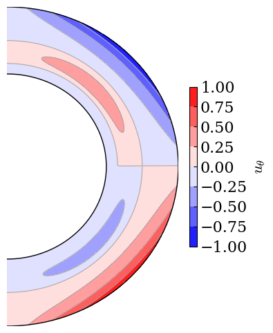

Get started with CTDYN
======================

.. code:: ipython3

    import py_ctdyn as dyn

.. code:: ipython3

    dir_out = "ctdyn_output"

.. code:: ipython3

    ctdyn_param = {"outputs" : {"dir":"'{}'".format (dir_out)},
                   }

.. code:: ipython3

    dyn.run_ctdyn (ctdyn_param=ctdyn_param, verbose=True)

.. parsed-literal::

    Running CTDYN with input file 'ctdyn_output/inlist_ctdyn'.

.. parsed-literal::

    {'outputs': {'dir': "'ctdyn_output'"},
     'global': {},
     'profiles': {},
     'brent': {},
     'boundaries': {},
     'fields': {},
     'physics': {},
     'controls': {}}

.. code:: ipython3

    ii, time = 1, 2

.. code:: ipython3

    filename = "{}/pfld.{}.t{}.A00".format (dir_out, str (ii).zfill (6), 
                                                               str (time).zfill (2))
    r, theta, mesh = dyn.read_field_map (filename)
    fig = dyn.plot_meridional_map (r, theta, mesh, label=r"$B_r$")

.. code:: ipython3

    filename = "{}/tfld.{}.t{}.A00".format (dir_out, str (ii).zfill (6), 
                                                               str (time).zfill (2))
    r, theta, mesh = dyn.read_field_map (filename)
    fig = dyn.plot_meridional_map (r, theta, mesh, label=r"$B_\phi$")

.. image:: quickstart_files/quickstart_7_0.png

.. code:: ipython3

    filename = "{}/butf.000001.a00".format (dir_out)

.. code:: ipython3

    t, theta, mesh = dyn.read_butterfly_diagram_text_file (filename)
    fig = dyn.plot_butterfly_diagram (t, theta, mesh)

