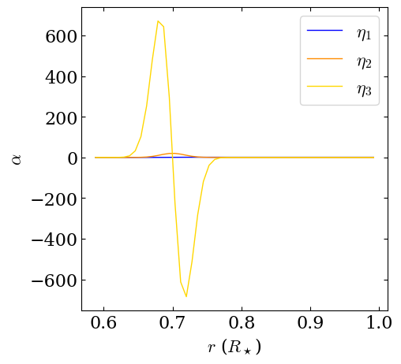
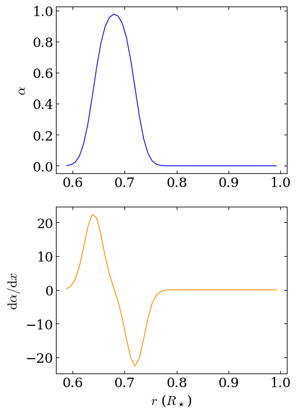
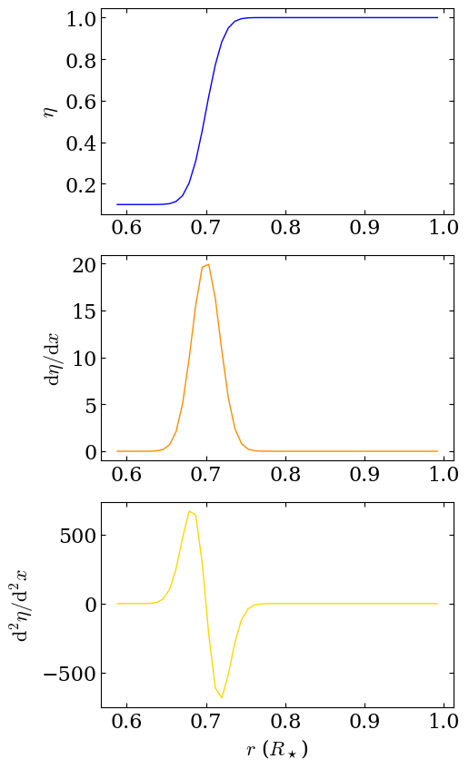

Get started with CTDYN
======================

.. code:: ipython3

    import py_ctdyn as dyn

.. code:: ipython3

    dir_out = "ctdyn_output"

.. code:: ipython3

    ctdyn_param = {"outputs" : {"dir":"'{}'".format (dir_out)},
                   }

.. code:: ipython3

    dyn.run_ctdyn (ctdyn_param=ctdyn_param, verbose=True,
                  rerun=False)

.. parsed-literal::

    Inlist file already exists and rerun=False, CTDYN was not executed.

.. parsed-literal::

    {'outputs': {'dir': "'ctdyn_output'"},
     'global': {},
     'profiles': {},
     'brent': {},
     'boundaries': {},
     'fields': {},
     'physics': {},
     'controls': {}}

.. code:: ipython3

    filename = "{}/alpha.dat".format (dir_out)
    df = dyn.read_radial_profiles (filename) 

.. code:: ipython3

    fig = dyn.plot_alpha (df)

.. image:: quickstart_files/quickstart_6_0.png

.. code:: ipython3

    fig = dyn.plot_eta (df)

.. code:: ipython3

    filename = "ctdyn_output/omega.dat"
    r, theta, mesh = dyn.read_field_map (filename)
    fig = dyn.plot_meridional_map (r, theta, mesh, 
                                   label=r"$\Omega$", 
                                   cmap="cividis")

.. code:: ipython3

    filename = "ctdyn_output/utheta.dat"
    r, theta, mesh = dyn.read_field_map (filename)
    fig = dyn.plot_meridional_map (r, theta, mesh, 
                                   label=r"$u_\theta$", 
                                   cmap="bwr")

.. image:: quickstart_files/quickstart_9_0.png

.. code:: ipython3

    filename = "ctdyn_output/stream.dat"
    r, theta, mesh = dyn.read_field_map (filename)
    fig = dyn.plot_meridional_map (r, theta, mesh, 
                                   label=r"Circulation", 
                                   cmap="bwr")

.. code:: ipython3

    ii, time = 1, 2

.. code:: ipython3

    filename = "{}/pfld.{}.t{}.A00".format (dir_out, str (ii).zfill (6), 
                                            str (time).zfill (2))
    r, theta, mesh = dyn.read_field_map (filename)
    fig = dyn.plot_meridional_map (r, theta, mesh, label=r"$B_r$",
                                   mode="contourf")

.. code:: ipython3

    filename = "{}/tfld.{}.t{}.A00".format (dir_out, str (ii).zfill (6), 
                                            str (time).zfill (2))
    r, theta, mesh = dyn.read_field_map (filename)
    fig = dyn.plot_meridional_map (r, theta, mesh, label=r"$B_\phi$")

.. code:: ipython3

    filename = "{}/butf.000001.a00".format (dir_out)
    t, theta, mesh = dyn.read_butterfly_diagram (filename)
    fig = dyn.plot_butterfly_diagram (t, theta, mesh)

.. image:: quickstart_files/quickstart_14_0.png

.. code:: ipython3

    filename = "{}/brbp.000001.a00".format (dir_out)
    t, theta, mesh = dyn.read_butterfly_diagram (filename)
    fig = dyn.plot_butterfly_diagram (t, theta, mesh)

.. image:: quickstart_files/quickstart_15_0.png

