Running CTDYN in parallel
=========================

.. code:: ipython3

    import py_ctdyn as dyn
    import os, pathos
    from tqdm import tqdm

.. code:: ipython3

    def parallel_run_wrapper (ctdyn_param) :
        """
        Wrapper to perform the CTDYN parallel run.
        """
        dyn.run_ctdyn (ctdyn_param=ctdyn_param, verbose=False,
                       rerun=False)

.. code:: ipython3

    dir_out = "parallel_run"
    if not os.path.exists (dir_out) :
        os.mkdir (dir_out)

.. code:: ipython3

    params = []
    nrun = 4
    cm_i = np.logspace (2, 2+nrun, nrun, endpoint=False)
    for ii in range (nrun) :
        param = {"outputs" : {"dir":"'{}/run_{}'".format (dir_out, ii+1)},
                 "controls" : {"cm_i":cm_i[ii]}
                 }
        params.append (param)

.. code:: ipython3

    params

.. parsed-literal::

    [{'outputs': {'dir': "'parallel_run/run_1'"}, 'controls': {'cm_i': 100.0}},
     {'outputs': {'dir': "'parallel_run/run_2'"}, 'controls': {'cm_i': 1000.0}},
     {'outputs': {'dir': "'parallel_run/run_3'"}, 'controls': {'cm_i': 10000.0}},
     {'outputs': {'dir': "'parallel_run/run_4'"}, 'controls': {'cm_i': 100000.0}}]

.. code:: ipython3

    process_pool = pathos.pools._ProcessPool (processes=2,
                                              maxtasksperchild=1)
    with process_pool as p :
        list (tqdm (p.imap (parallel_run_wrapper,
                            params,
                            ),
                    total=len (params))
              )
        p.close ()

.. parsed-literal::

      0%|                                                                                                                                     | 0/4 [00:00<?, ?it/s]

.. code:: ipython3

    jj, time = 1, 1

.. code:: ipython3

    for ii in range (nrun) :
        filename = "{}//run_{}/pfld.{}.t{}.A00".format (dir_out, ii+1, str (jj).zfill (6), 
                                                        str (time).zfill (2))
        r, theta, mesh = dyn.read_field_map (filename)
        fig = dyn.plot_meridional_map (r, theta, mesh, label=r"$B_p$",
                                       mode="contourf")

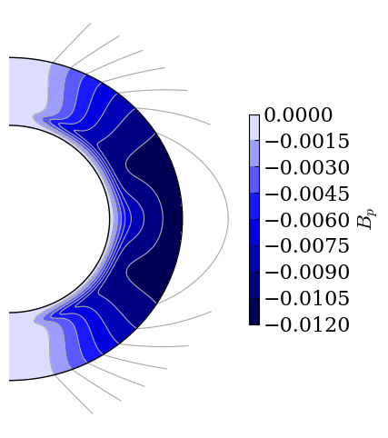

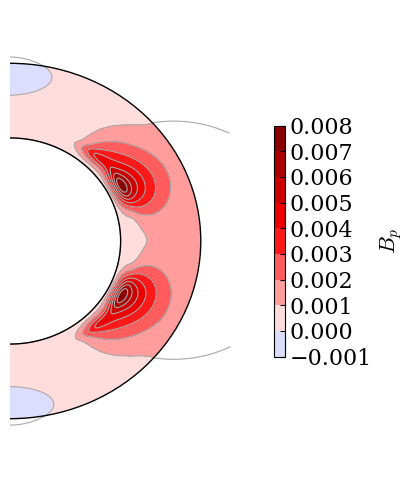

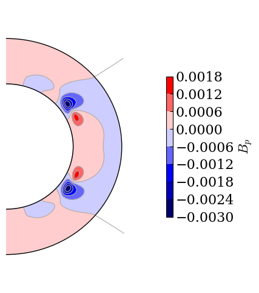

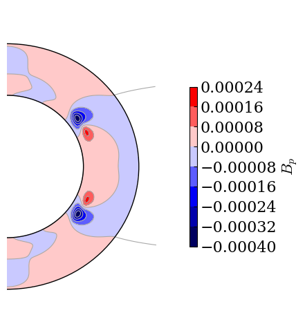

.. code:: ipython3

    for ii in range (nrun) :
        filename = "{}//run_{}/tfld.{}.t{}.A00".format (dir_out, ii+1, str (jj).zfill (6), 
                                                        str (time).zfill (2))
        r, theta, mesh = dyn.read_field_map (filename)
        fig = dyn.plot_meridional_map (r, theta, mesh, label=r"$B_p$",
                                       mode="contourf")

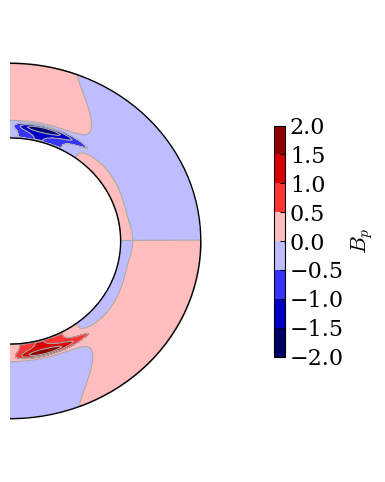

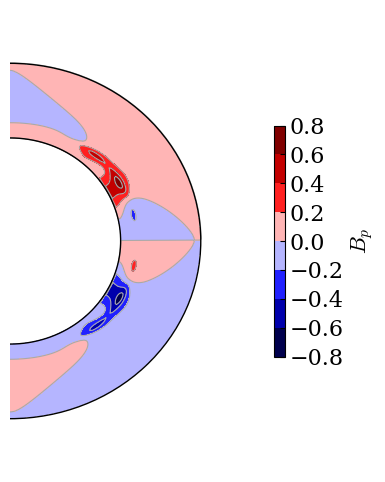

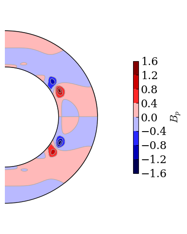

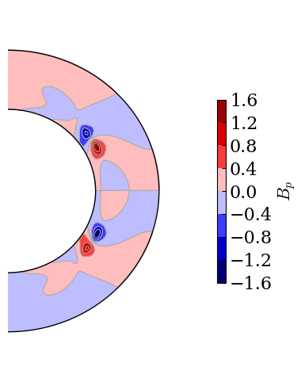

.. code:: ipython3

    for ii in range (nrun) :
        filename = "{}/run_{}/butf.000001.a00".format (dir_out, ii+1)
        t, theta, mesh = dyn.read_butterfly_diagram (filename)
        fig = dyn.plot_butterfly_diagram (t, theta, mesh)

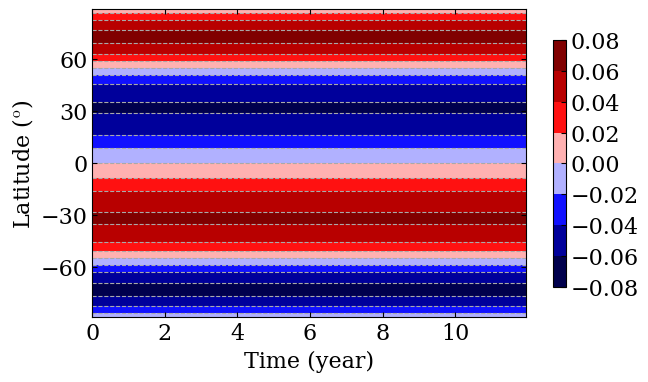

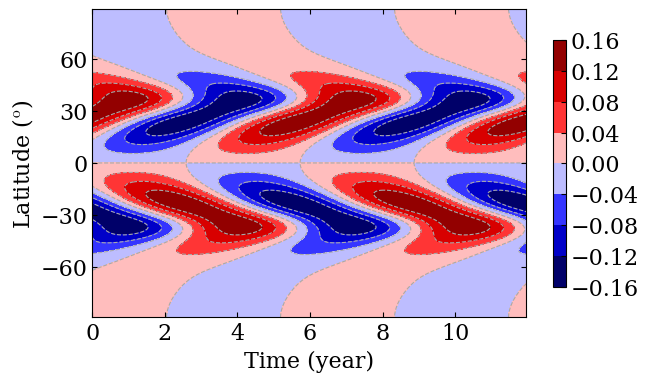

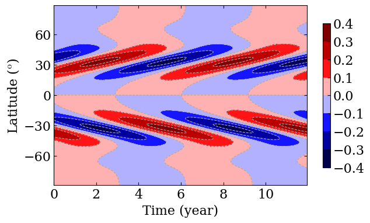

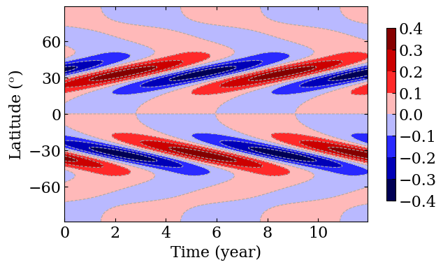

.. code:: ipython3

    for ii in range (nrun) :
        filename = "{}/run_{}/brbp.000001.a00".format (dir_out, ii+1)
        t, theta, mesh = dyn.read_butterfly_diagram (filename)
        fig = dyn.plot_butterfly_diagram (t, theta, mesh)

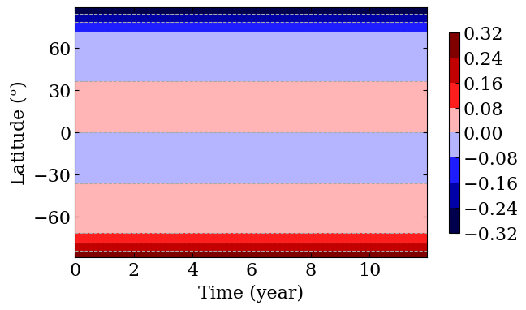

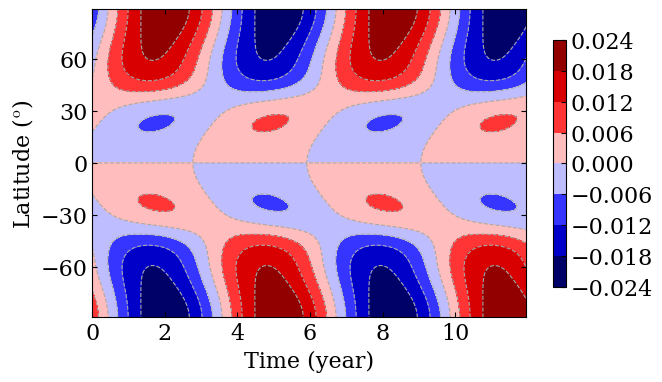

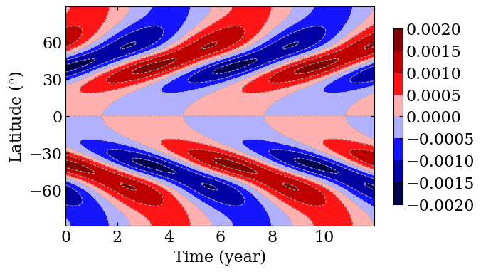

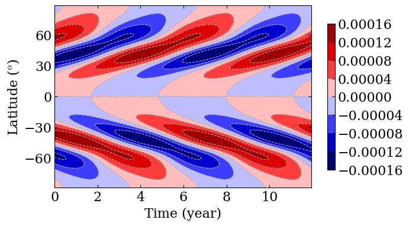

